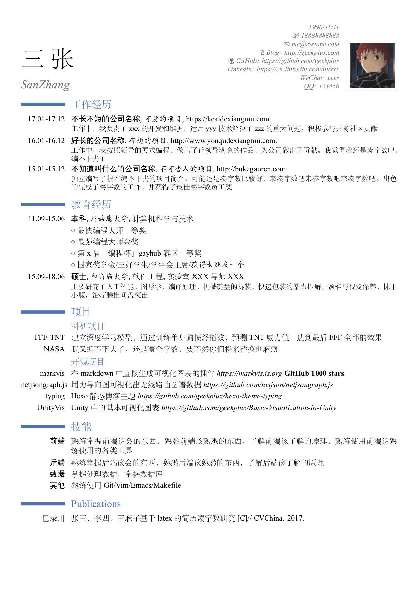

# cv_resume

中文简历 Latex 模板。基于 ModernCV 模板，进行了中文字体支持和优化，使用 **xelatex** 编译。

- 字体和大小的宏在 `.tex` 文件中都有注释
- 外边距可以通过 `scale` 调整
- 标题与正文的间距可以 `\vspace` 调整。

## Usage

*\*我自己是用 emacs 在 MacOS 上编译的，其他途径还没试过*

安装xelatex(可通过安装[MacTeX](http://www.tug.org/mactex/)将需要的包全部安装)。然后运行

```bash
make
```

## Preview



# LICENSE

**cv_resume** © [geekplux](https://github.com/geekplux), Released under the [MIT](./LICENSE) License.<br>

> [geekplux.com](http://geekplux.com) · GitHub [@geekplux](https://github.com/geekplux) · Twitter [@geekplux](https://twitter.com/geekplux)
